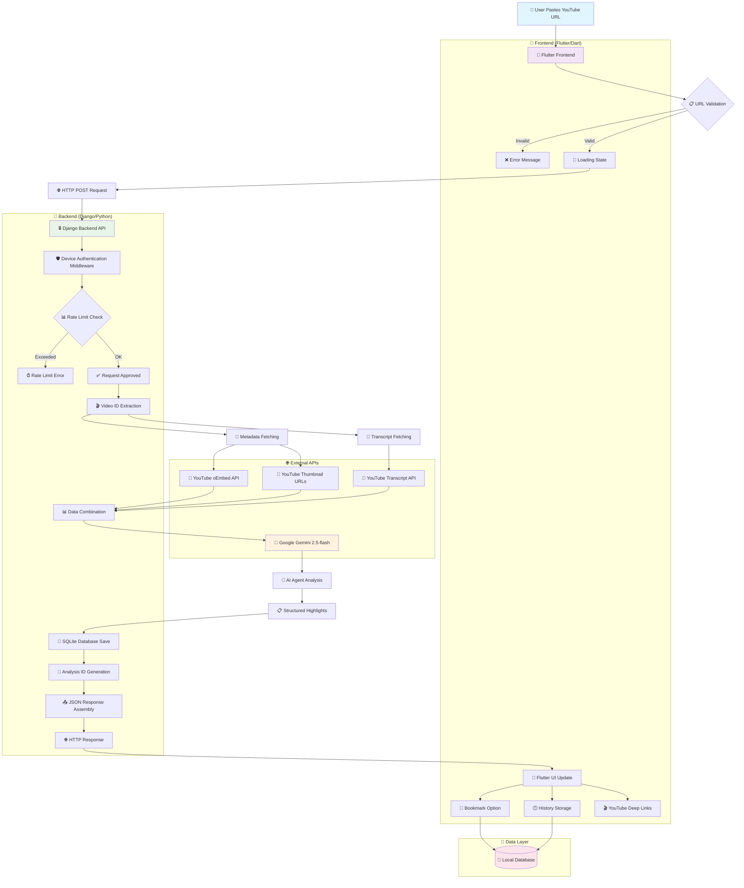

# Time Saver App - Complete Architecture Flow

## 🏗️ **End-to-End System Architecture**



## 🔄 **Detailed Data Flow**

### **Phase 1: User Input & Validation**

```
User Input → URL Validation → Loading State
```

### **Phase 2: Authentication & Security**

```
HTTP Request → Device UUID Check → Rate Limiting (5/60s) → Authorization
```

### **Phase 3: Video Data Extraction**

```
YouTube URL → Video ID Regex → Parallel API Calls:
├── oEmbed API (title, metadata)
├── Transcript API (captions + timestamps)
└── Thumbnail URLs (image links)
```

### **Phase 4: AI Processing**

```
Combined Data → Gemini 2.5-flash → 3-Agent Analysis:
├── 🎓 Teacher Agent (educational moments)
├── 📊 Analyst Agent (data/metrics)
└── 🔍 Explorer Agent (actionable insights)
```

### **Phase 5: Data Persistence**

```
AI Results → SQLite Database → Analysis ID → Device Isolation
```

### **Phase 6: User Experience**

```
JSON Response → Flutter UI → Interactive Features:
├── 🔖 Bookmark System
├── 🕒 History Tracking
├── 🎬 YouTube Deep Links
└── 🔍 Search Functionality
```

## 📊 **Technology Stack Breakdown**

### **Frontend Technologies**

- **Framework**: Flutter/Dart
- **State Management**: Built-in StatefulWidget
- **HTTP Client**: Built-in http package
- **URL Handling**: url_launcher package
- **UI Components**: Material Design

### **Backend Technologies**

- **Framework**: Django REST Framework
- **Database**: SQLite3
- **Authentication**: Device UUID (no login required)
- **Rate Limiting**: Django LocMemCache
- **CORS**: django-cors-headers

### **External APIs**

- **YouTube oEmbed API**: `youtube.com/oembed`
- **YouTube Transcript API**: `youtube-transcript-api` library
- **Google Gemini**: `google-generativeai` library
- **YouTube Thumbnails**: Direct image URLs

### **Data Models**

```python
VideoAnalysis: id, device_id, url, title, duration, thumbnail, highlights, timestamp
VideoBookmark: id, device_id, analysis_id, timestamp
UserSession: id, device_id, last_request_time, request_count
```

## 🔒 **Security & Performance Features**

### **Authentication**

- Device-based UUID system
- No user accounts required
- Device isolation for all data

### **Rate Limiting**

- 5 requests per 60 seconds per device
- Automatic cleanup of expired sessions
- Graceful error handling

### **Error Handling**

- Multi-tier fallback system
- Graceful degradation
- Comprehensive logging

### **Performance Optimizations**

- Strategic transcript sampling (12K-18K chars)
- Single AI API call
- Cached responses
- Optimized database queries

## 🚀 **Deployment Architecture**

### **Recommended Stack**

```
Frontend: Netlify (Flutter Web)
Backend: Railway (Django + PostgreSQL)
Domain: Custom domain with HTTPS
```

This architecture provides a complete, scalable solution for YouTube video analysis with AI-powered insights, all while maintaining user privacy and optimal performance.
